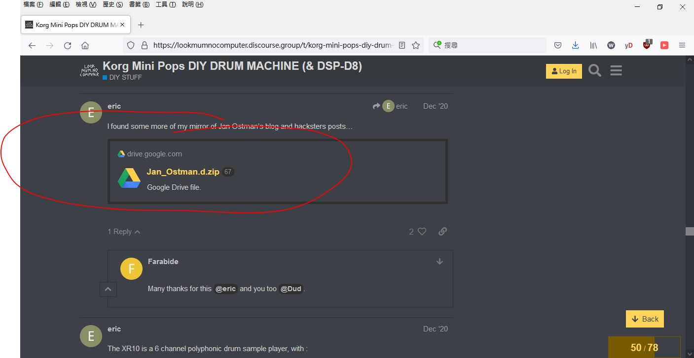

# Jan-Ostman-MCU-synth
Do not use for comercial, for own education purpose only!!! AVR / MCU audio synthesizer design, this is the blog/code and copied content, from the google and searched.  

### according one of codes and original author, GPL3
so I set here GPL3 too.

```
// (*) All in the spirit of open-source and open-hardware
// Janost 2017 Sweden

// The Breadboard-TS 
// https://janostman.wordpress.com/the-breadboard-ts/

// Copyright 2017 DSP Synthesizers Sweden. 
// 
// Author: Jan Ostman 
// 
// This program is free software: you can redistribute it and/or modify 
// it under the terms of the GNU General Public License as published by 
// the Free Software Foundation, either version 3 of the License, or 
// (at your option) any later version. 
// This program is distributed in the hope that it will be useful, 
// but WITHOUT ANY WARRANTY; without even the implied warranty of 
// MERCHANTABILITY or FITNESS FOR A PARTICULAR PURPOSE.  See the 
// GNU General Public License for more details. 
```


### The AVR / MCU audio synthesizer design  
Jan Ostman was no longer public for the selling and ripped off all those content, someone were telling payment done but never received ordered stuff, something was odd. This is the blog/code and copied content, from the google and searched.

I had a few of the test rig build according to the design and code, and must be clear to say, Jan Ostman was genius in this territory or perhaps professional, but overall it is not to comment any of those selling or biz.

### Jan Ostman's work pieces, all gone except webarchive machined.  
https://web.archive.org/web/20190726181617/http://blog.dspsynth.eu/

### the blog/code archived by someone in this world, and Eric had shared as historical in data ocean,  
https://lookmumnocomputer.discourse.group/t/korg-mini-pops-diy-drum-machine-dsp-d8/2316/50
https://drive.google.com/file/d/14jT04LqOR8lIHQ-UmVxMCjaT-c5uOuwW/view
   


### my build and test
I had chance that to build one from the Jan's project but lost all those learning notes as the PC switched and moving living town, this is perhaps the first time and able to recovered those code and to learn those designs again.
my clone of 2019, [人生總有第一次, 試做 Synth 合成器](https://xiaolaba.wordpress.com/2019/03/05/%e4%ba%ba%e7%94%9f%e7%b8%bd%e6%9c%89%e7%ac%ac%e4%b8%80%e6%ac%a1-%e8%a9%a6%e5%81%9a-synth-%e5%90%88%e6%88%90%e5%99%a8/)  

### my download and cached here
[Jan_Ostman.d.zip](https://drive.google.com/drive/folders/1wYk_ouCOsidifTK9WATTX_tYTJs5JvcE?usp=sharing)
